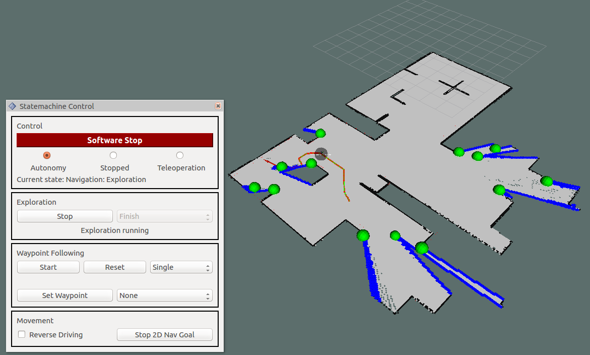
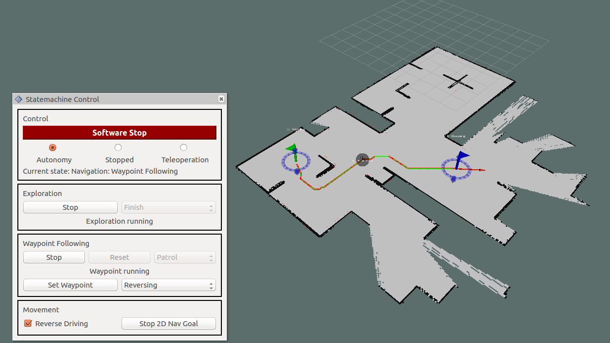
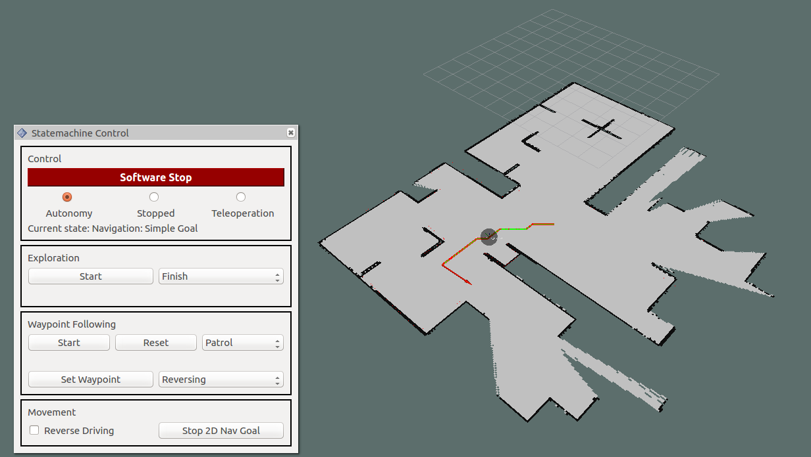

# Robot Statemachine
A statemachine for exploration and waypoint following for arbitrary robots in inspection, rescue or similar scenarios. The statemachine is built to be used with custom navigation and exploration as well as mapping procedures and routines. It can be controlled by the provided plugins for RViz and/or rqt. Below, from left to right exploration, waypoint_following and simple goal navigation can be seen in RViz with the statemachine's GUI plugin.

  
   
   

The statemachine with it's base state and non-customizable states as well as it's data and interface handler is located in the [statemachine package](statemachine#statemachine). Messages and services created for the statemachine are located in the [statemachine_msgs package](statemachine_msgs#statemachine-msgs). Exemplary custom states for exploration, navigation and routines together with a handler class for their data are placed inside the [statemachine_additions package](statemachine_additions#statemachine-additions). GUI plugins for RViz that include a panel with controls, the **Plant Waypoint Tool** and an interactive marker visualization for waypoints can be found in [statemachine_rviz_plugins](statemachine_rviz_plugins#statemachine-rviz-plugins). The same panel with controls can also be added as a plugin for rqt and is included in the [statemachine_rqt_plugins package](statemachine_rqt_plugins#statemachine-rqt-plugins).

For a detailed description of the statemachine's operation as well as tutorials and examples describing how to write plugins, integrate them into the statemachine and setup your robot to use the statemachine go to the [statemachine package](statemachine#statemachine).
