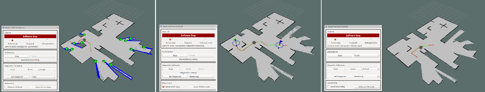

# Robot Statemachine (RSM)
A state machine for exploration and waypoint following for arbitrary robots in inspection, rescue or similar scenarios. The RSM is built to be used with custom navigation and exploration as well as mapping procedures and routines. It can be controlled by the provided plugins for RViz and/or rqt. Below, from left to right exploration, waypoint_following and simple goal navigation can be seen in RViz with the RSM's GUI plugin.



The RSM with it's base state and non-customizable states as well as it's data and interface handler is located in the [rsm_core package](rsm_core#rsm-core). Messages and services created for the RSM are located in the [rsm_msgs package](rsm_msgs#rsm-msgs). Exemplary custom states for exploration, navigation and routines together with a handler class for their data are placed inside the [rsm_additions package](rsm_additions#rsm-additions). GUI plugins for RViz that include a panel with controls, the **Plant Waypoint Tool** and an interactive marker visualization for waypoints can be found in [rsm_rviz_plugins](rsm_rviz_plugins#rsm-rviz-plugins). The same panel with controls can also be added as a plugin for rqt and is included in the [rsm_rqt_plugins package](rsm_rqt_plugins#rsm-rqt-plugins).

For a detailed description of the state machine's operation as well as tutorials and examples describing how to write plugins, integrate them into the RSM and setup your robot to use the RSM go to the [rsm_core package](rsm_core#rsm-core).

## Citing

If you use RSM in an academic context, please cite the following [publication](https://dl.acm.org/doi/abs/10.1145/3448823.3448857):

```
@inproceedings{RSM,
address = {New York, NY, USA},
author = {Steinbrink, Marco and Koch, Philipp and May, Stefan and Jung, Bernhard and Schmidpeter, Michael},
booktitle = {Proceedings of the 2020 4th International Conference on Vision, Image and Signal Processing},
doi = {10.1145/3448823.3448857},
isbn = {9781450389532},
month = {dec},
pages = {1--6},
publisher = {ACM},
title = {{State Machine for Arbitrary Robots for Exploration and Inspection Tasks}},
url = {https://dl.acm.org/doi/10.1145/3448823.3448857},
year = {2020}
}
```
