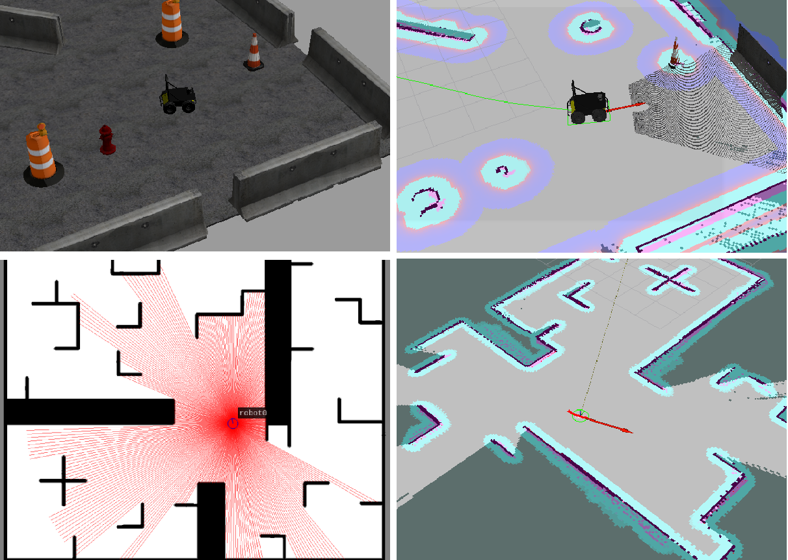
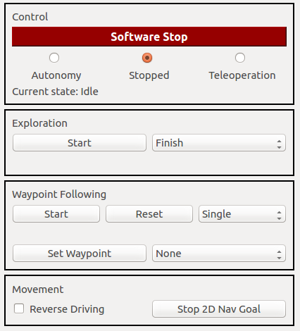
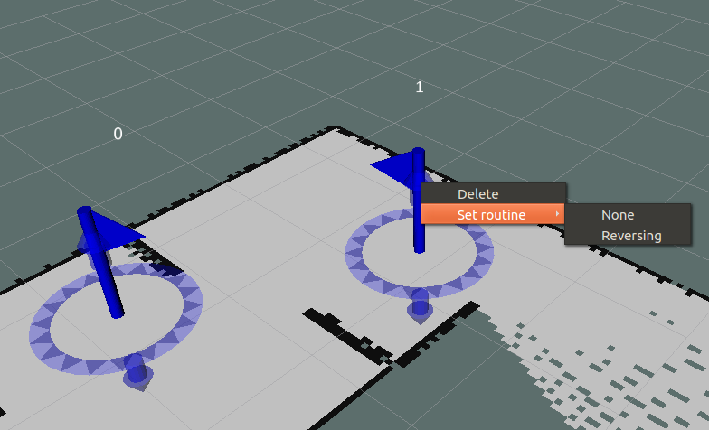

#  RSM Core

The Robot Statemachine's core components will be explained first and it's usage afterwards, including examples and tutorials for writing plugins, including them into the RSM and setting up a robot. Also, handling the GUI and starting a simulation with the RSM is explained.

## Documentation

The RSM consists of various non-customizable and custom states that are based on the [Base State](#base-state). The former [non-customizable states](#non-customizable-states) and the [Base State](#base-state) are a part of this package containing the RSM's basics.  
To handle state transitions the [State Interface](#state-interface) is used. [Robot Control Mux](#robot-control-mux) coordinates the actual control of the robot's movement while the [Service Provider](#service-provider) contains services, publishers and subscribers for communication between states and updating the GUI. To be able to handle arbitrary robots, the RSM relies on [Plugins](#plugins) that can be implemented depending on the robot.

### Base State

The base state for all states of the RSM features the following four main functions:
* onSetup
* onEntry
* onActive
* onExit

The function `onSetup` is called immediately after it was constructed and should be used to initialize the state. The function `onEntry` is run before the state's `onActive` method is executed for the first time and should be used to start up the processing in the state. The latter is the state's primary method that is executed periodically and contains it's main logic. `onExit` is called before the state will be destroyed and should take care of leaving the state cleanly.

To realize interrupts in the RSM, the following five functions need to be implemented:
* onExplorationStart
* onExplorationStop
* onWaypointFollowingStart
* onWaypointFollowingStop
* onInterrupt

These functions handle commands issued from the GUI or the use of teleoperation by telling the current state which command or interrupt occurred and let the state handle it. The method `onInterrupt` receives the type of interrupt which are also defined in the Base State and are listed below:
* INTERRUPT\_END: Former interrupt ended (only relevant to specific interrupt handlers)
* EMERGENCY\_STOP\_INTERRUPT: Emergency Software Stop was pushed in the GUI
* TELEOPERATION\_INTERRUPT: Teleoperation was used
* SIMPLE\_GOAL\_INTERRUPT: A navigation goal was issued through the RViz GUI
* SIMPLE\_GOAL\_STOP\_INTERRUPT: The navigation goal was stopped in the GUI

The four other methods receive a reference to a bool and a string variable. The former informs if the request was successful and the desired action will be executed (true) or not (false) and the latter features a descriptive text.

The Base State holds a reference to the [State Interface](#state-interface) which has to be used for state transitions. It also has a variable with it's name that is necessary to display the current state in the GUI and needs to be set in the `onSetup` or `onEntry` method.

### State Interface

The State Interface holds a reference to the current state and handles state transitions. It also provides references to plugins created for exploration, navigation, mapping or routines.
The State Interface provides the method `transitionToVolatileState` which will initiate a transition to the state provided as an argument. The provided argument is a `boost::shared_ptr` of the Base State type. This can be one of the known [non-customizable states](#non-customizable-states) or a custom state defined through a plugin. 

To access these plugins State Interface offers the method `getPluginState` which takes the plugin type and optionally a plugin routine name as parameters. The former can be one of the following types:
* CALCULATEGOAL\_STATE
* NAVIGATION\_STATE
* MAPPING\_STATE
* ROUTINE\_STATE

For a *ROUTINE_STATE* the routine name needs to be provided as well, otherwise this parameter can remain empty. The other plugin states are set by parameters provided to State Interface on launch. If no plugin type was specified but only a name, arbitrary plugins can be created and returned for state transition. If no plugin type and name were received or the desired plugin to be created does not exist, the **Idle State** will be returned and an error message put out. 

State Interface subscribes to the *stateInfo* and *simpleGoal* topics to issue interrupts to the currently active state. Furthermore, it offers the two services *startStopExploration* and *startStopWaypointFollowing* which call the particular function in the active state.

The State Interface updates the currently active state periodically through it's `awake` function. This function also executes the state transition initiated by `transitionToVolatileState` and calls the active state's methods.

### Robot Control Mux

The Robot Control Mux (=Multiplexer) controls the velocity commands sent to the ROS node interfacing the motor controllers. In a simple configuration,	 a navigation or teleoperation node would output velocity commands that will be received by the motor controller interface and move the robot. To enable high level control of the input the motor controller receives, the Robot Control Mux should be the only node in the setup publishing directly on the topic the motor controller interface subscribes to.  

Velocity commands generated by navigation should be published to an autonomy topic and velocity commands issued by teleoperation to a teleoperation topic. These two topics are subscribed by the Robot Control Mux that decides which or if any topic will be forwarded. The two input and the output topic's names are set by parameters at launch.

Which topic will be conducted is based on the operation mode which can be one of the following:
* Autonomy
* Stopped
* Teleoperation

For *Autonomy* and *Teleoperation* the respective topic is propagated to the motor controller interface. If the operation mode is set to *Stopped* a command velocity of zero for all directions is published. The operation mode can be set through the GUI by a service Robot Control Mux is providing. It is published to the GUI for display as well. If a teleoperation command is issued, the mode automatically switches to *Teleoperation*. When in *Teleoperation* mode, a timer is started to supervise if new commands are being issued. If no new commands are received for the timer duration (which is set through a parameter), *Teleoperation* is replaced with the *Stopped* mode.

If the software emergency stop is activated in the GUI, the operation mode is handled as *Stopped* and cannot be changed until the stop button is released again.

### Service Provider

The Service Provider handles the communication between the different states and saves data throughout state transitions. Therefore it offers a lot of services to save and retrieve variables for the core functionality of the RSM.

It offers all services to control waypoint following which includes adding, moving and removing single waypoints, setting their `visited` and `unreachable` variables and the routine to be executed upon reaching the waypoint. Furthermore, all waypoints can be retrieved and reset which effectively sets `visited` and `unreachable` to false. The waypoint following mode can be set and the list of all available routines retrieved. The latter is given as a parameter to the Service Provider. The list of waypoints is also published.

For setting and retrieving the current navigation goal the Service Provider is offering services. In addition, previously failed goals can be set, retrieved or reset. These serve as a way of blacklisting goals.

The current robot pose can be retrieved and is calculated from the transform of the map to the robot's base footprint.

The Service Provider hosts services for exploration that enable setting and getting the exploration mode. It is also published. If the exploration mode is set to *Interrupt*, the Service Provider subscribes to the list of available exploration goals and checks if the current navigation goal is still in this list. A tolerance for comparing these positions can be set with a parameter. If the navigation goal is not an exploration goal anymore, it becomes obsolete. This info is published when the mode is set to *Interrupt* as well.

Furthermore, it advertises services for setting and retrieving the reverse mode, which is also published.  

### Non-customizable states

The core state machine already features the following states for direct usage:
* **Boot State:** Is the first state to be called and subscribes to a service which tells it when all necessary systems are available and ready to use. Then it initiates a transition to the **Idle State**. Can only be interrupted by the software emergency stop. 
* **Emergency Stop State:** State being called when the software emergency stop was pushed. Only allows transition to **Idle State** when button is released.
* **Idle State:** Standard state when no commands were issued. Allows transitions to all other states through interrupts.
* **Teleoperation State:** State being called when teleoperation commands were issued. Only transitions to **Idle State** when teleoperation timed out and **Emergency Stop State** when receiving the respective interrupt.
* **Waypoint Following State:** Handles the waypoint following functionality by providing the next navigation goal depending on the status of all waypoints and the waypoint following mode. Normally transitions to the navigation state plugin. Can be interrupted by the software emergency stop and teleoperation which leads to a transition to the particular state. If waypoint following is stopped, transitions to **Idle State**.

### Plugins

The RSM package requires three different plugin states, one for exploration to calculate the next goal, one for navigation and one for mapping. The first is called when exploration is started or a previous exploration target was mapped successfully and  should interface an exploration package like [explore lite](http://wiki.ros.org/explore_lite) which finds unexplored regions in the map and extract a next goal from it. The second should interface a package for navigation like the [ROS navigation stack](http://wiki.ros.org/navigation) and update the RSM according to the navigation's progress. The last is called when an exploration goal is reached and can include movements for better map acquisition or similar behaviors.

Also, up to ten plugins states can be included for the waypoint following routines that are executed upon reaching a waypoint. They are not necessary for the RSM like the plugins mentioned above. These routines can be implemented to enable arbitrary behavior when reaching a certain waypoint, for example inspecting gauge valves with a camera.

More plugins can be added if additional states during exploration or waypoint following are desired. These can only be called from other implemented plugin states as the basic RSM only includes transitions to the plugins described above. For example, if you have a robot able to climb stairs and you detect stairs during navigation, you can then call another plugin for stair-climbing and afterwards transition back to normal navigation.

## Tutorials

The following section displays some examples and tutorials on how to use the RSM, starting with the required setup to use the RSM. Afterwards, running and launching the RSM on its own and in a simulation environment is presented. The provided GUI and it's controls are shown and a tutorial on writing and including your own plugin state is presented last.

### Set up a robot for use with RSM

Setting up a robot for the basic RSM usage is fairly straightforward since it only requires setting up a robot motor controller interface that subscribes to command velocity messages of type [geometry_msgs/Twist](http://docs.ros.org/api/geometry_msgs/html/msg/Twist.html) and generates actual motor commands from them.

A service provider to tell the **Boot State** that the boot is finished is also required. This should ideally check if all necessary systems on your robot are up and running. The service provider needs to offer a service of type [std_srvs/SetBool](http://docs.ros.org/api/std_srvs/html/srv/SetBool.html) under the name "rsm/bootUpFinished". The following code snippet shows a rudimentary sample implementation in a node:

```cpp
#include "ros/ros.h"
#include "std_srvs/SetBool.h"

bool boot_finished = false;

bool bootUpService(std_srvs::SetBool::Request &req,
		std_srvs::SetBool::Response &res) {
	if (boot_finished) {
		res.success = 1;
		res.message = "Finished";
	} else {
		res.success = false;
		res.message = "Still booting ...";
	}
	return true;
}

int main(int argc, char **argv) {
	ros::init(argc, argv, "bootUpNode");
	ros::NodeHandle nh("rsm");
	ros::ServiceServer bootup_service = nh.advertiseService("bootUpFinished",
			bootUpService);
	//checking boot process and setting boot_finished to true if finished
	ros::spin();
	return 0;
}
```

If this is not possible or necessary for your configuration, you can just launch the `bootUpNode` from the [RSM additions package](../rsm_additions#rsm-additions) that sets up the service provider and returns a successful boot message after default 1 second. The delay can be set using the parameter `wait_time`. 

The setup for navigating to set goals and executing mapping behaviors or routines depends on the defined plugins and can therefore not generally be declared.

*Note*: If you plan on using the plugins for [ROS navigation](http://wiki.ros.org/navigation) provided in the [RSM additions package](../rsm_additions#rsm-additions), you need to follow the [navigation stack robot setup tutorial](http://wiki.ros.org/navigation/Tutorials/RobotSetup).

In general, a tool for navigation, a tool for mapping and a tool for exploration are necessary to fully exploit the robot RSM. This includes at least one sensor for sensing the environment, creating a 2D or 3D map and running SLAM. When provided with the particular exploration and navigation plugins, the RSM will work for 3D maps.

### Run RSM

The RSM's core functionality is distributed over several nodes that can simply be started with the launchfile `rsm.launch` which requires the following arguments:
* `update_frequency`: The update rate in Hz of the RSM (default: 20)
* `robot_frame`: The robot base frame (default: "base_footprint")
* `mapping_plugin`: The plugin used for mapping (default: ["rsm::MappingDummyState"](../rsm_additions#mapping-dummy-state))
* `calculate_goal_plugin`: The plugin used to calculate the next goal for exploration	 (default: ["rsm::CalculateGoalState"](../rsm_additions#calculate-goal-state))
* `navigation_plugin`: The plugin used for navigation (default: ["rsm::NavigationState"](../rsm_additions#navigation-state))
* `autonomy_cmd_vel_topic`: The name of the command velocity topic for messages from exploration, waypoint following or simple goals (default: "/autonomy/cmd_vel")
* `teleoperation_cmd_vel_topic`:	The name of the command velocity topic for messages from teleoperation (default: "/teleoperation/cmd_vel")
* `cmd_vel_topic`: The name of the command velocity topic that the motor controller interface subscribes to (default: "/cmd_vel)
* `teleoperation_idle_timer`: Time in seconds without input from teleoperation that leads to a transition to **Idle State** (default: 0.5)
* `waypoint_routines`: List of all plugins to be used as routines for waypoints (default: [])
* `exploration_goal_tolerance`: Distance in all directions in meters that the robot's current position can differ from an exploration goal to still count it as reached (default: 0.05)

*Note*: The default plugins mentioned above all exist in the [RSM additions package](../rsm_additions#rsm-additions).

The nodes can of course be started separately though it is easier to use the launch file. 

### Launch simulation

To demonstrate the RSM and get used to it's controls, the [RSM additions package](../rsm_additions#rsm-additions) offers two launch files that start a simulation including a complete robot and environment to start right away.

The first simulation uses the 3D [Gazebo](http://gazebosim.org/) simulator which has to be [installed](http://gazebosim.org/tutorials?cat=install) before. Furthermore, it depends on the [husky simulator package](http://wiki.ros.org/husky_simulator) which includes the robot to be simulated. The second simulation depends on the [stdr simulator package](http://wiki.ros.org/stdr_simulator) which is solely in 2D and offers a much less CPU-intensive alternative to Gazebo. If your machine is not very powerful or you just want to have a quick peek at what the RSM has to offer, stick with the stdr simulator. Screenshots from both simulations can be seen below, [Gazebo](http://gazebosim.org/) first and [stdr simulator](http://wiki.ros.org/stdr_simulator) last, the simulation on the left and RViz on the right. 



Both simulations use the plugins implemented in [RSM additions](../rsm_additions#rsm-additions) which need the following packages to be installed:
* [gmapping](http://wiki.ros.org/gmapping) for SLAM
* [ROS navigation stack](http://wiki.ros.org/navigation) for the [Navigation State](../rsm_additions#navigation-state)
* [explore lite](http://wiki.ros.org/explore_lite) for the [Calculate Goal State](../rsm_additions#calculate-goal-state)

When the above prerequisites are met, the simulations can be launched with the following commands including a pre-configured RViz display. If you do not want to start RViz, just leave out the `rviz:=true`. 

For gazebo:
  
```
roslaunch rsm_additions simulation_gazebo.launch rviz:=true
```

For the stdr simulator:
  
```
roslaunch rsm_additions simulation_stdr.launch rviz:=true
```

### GUI introduction

The RSM can be operated through a GUI that enables the use of all it's core functionalities. The GUI panel is depicted below and can be integrated into [RViz](http://wiki.ros.org/rviz) or [rqt](http://wiki.ros.org/rqt). To the former by adding a new panel through *Panels->Add New Panel* and then choose *RSMControlPanel* under *rsm_rviz_plugins*. To the latter by adding a new plugin through *Plugins->RSM Control*. The GUI always shows which state is currently active and provides the options explained below.



The GUI offers control over the class handling the command velocities forwarded to the motor controller interface. This includes the software emergency stop as well as choosing autonomy, teleoperation or stopped. When the software emergency stop is active, the other choices are disabled and the command velocity is set to stopped until the software emergency stop is released again.

The exploration can be started and stopped by using the respective buttons in the GUI. Next to the button is a drop-down box where the exploration mode can be set. This mode can either be *Finish* or *Interrupt* where the former lets the robot reach each goal before transitioning to **Mapping State** while the latter starts the transition as soon as the current goal is no longer listed as an exploration goal. The mode can only be set before starting
exploration and not while it is running.

Waypoint following can also be started and stopped through the respective buttons. Furthermore, when waypoint following is stopped, there is the option to reset the current progress and restore all waypoints to their initial values. It is possible to set the waypoint following mode using the drop-down box next to the formerly mentioned buttons. The waypoint following mode can be one of the following three and only changed when stopped: 
* single
* roundtrip
* patrol

The single mode lets the robot start from the first waypoint and then to all consecutive ones. Upon reaching the last one it stops. In roundtrip mode, after reaching the last waypoint all waypoints are reset and it starts anew from waypoint one. This is repeated until manually stopped. Patrol mode works in a similar fashion. After reaching the last waypoint all waypoints are reset and it starts again in reverse order. The first and last waypoints are only targeted once and their attached routines executed only once as well. Also, it can only be stopped manually.

The GUI also offers the possibility to set a waypoint at the robot's current location and with the robot's current orientation. These waypoint's routines can be set from the drop-down box next to the button setting the actual waypoint. 

Furthermore, a checkbox enables setting the reverse mode manually. When the box is checked the robot moves in reverse. A button next to the checkbox enables stopping the navigation when a simple navigation goal was set through RViz.

When using [RViz](http://wiki.ros.org/rviz), waypoints can be set by utilizing the **Plant Waypoint Tool** (Hotkey: "w"). It can be added through the plus button (Add a new tool) in the toolbar and then choosing *PlantWaypointTool* under *rsm_rviz_plugins*. This enables putting waypoints on the ground plane, determining their x- and y-coordinates, and orientate them  in yaw by dragging the mouse in the desired direction. They are depicted as [interactive markers](http://wiki.ros.org/interactive_markers) with a flagpole mesh and the number of the waypoint above. Accordingly, an interactive marker display needs to be added with the topic name *waypoint_markers/update* to show them. The color of the marker corresponds to the waypoint's status: blue is the default color, green means the waypoint has been visited and red that it is unreachable.

The displayed markers are interactive and can be seen below. Using the circle around them, they can be dragged in the desired direction, changing their x-y-position and yaw-orientation. The arrows above and below can be used to drag them in the respective direction, altering it's z-coordinate. Clicking on the waypoint marker opens a menu that offers the options to set the routine to be executed when reaching the waypoint and to delete the waypoint. The routine can also be set to none.



*Note*: When the robot is moving towards a waypoint, the specific waypoint can be manipulated but these changes will not be forwarded to the current navigation. So, changes made after the robot started to move towards the waypoint, will not be regarded until the waypoint and it's possible routine was finished.

The [RSM additions package](../rsm_additions#rsm-additions) features some exemplary [RViz configuration](http://wiki.ros.org/rviz/UserGuide#Configurations) files for the respective launch files that automatically include the GUI and **Plant Waypoint Tool** as well as adding the waypoint [interactive marker](http://wiki.ros.org/interactive_markers) topic to the display.

*Note:* When saving the RViz configuration, the **Plant Waypoint Tool** sometimes does not get included in the configuration and has to be added each time RViz is started manually. To fix this, you need to add `- Class: rsm::PlantWaypointTool` to your RViz configuration file by hand. It has to be appended under *Visualization Manager: Tools* as can be seen in the snippet below.

```
...
Visualization Manager:
  Class: ""
  Displays:
  ...
  Name: root
  Tools:
    ...
    - Class: rsm::PlantWaypointTool 
  Value: true
  ...
```

If the **2D Nav Goal Tool** (Hotkey: "g") from RViz should be used, the respective topic from RViz needs to be remapped, so that it works with the RSM. The following remap needs to be added to the RViz launch, otherwise the **2D Nav Goal Tool** cannot be used:  

```
<node if="$(arg rviz)" pkg="rviz" type="rviz" name="rviz" args="-d ...">
	<remap from="/move_base_simple/goal" to="/rsm/simpleGoal" />
</node>
```

*Note*: Replace the dots with the path to your configuration file.

### Writing a plugin state

To create a plugin state to be used with the robot RSM follow the upcoming steps. This is very similar to the ROS tutorial [Writing and Using a Simple Plugin](http://wiki.ros.org/pluginlib/Tutorials/Writing%20and%20Using%20a%20Simple%20Plugin) but also includes some specific details for the RSM.

In your package, add the following code to the respective files:   

*CMakeLists.txt:*

```
find_package(catkin REQUIRED COMPONENTS
  roscpp
  pluginlib
  rsm_core
  rsm_msgs
  ...
)
```

*package.xml:*

```xml
...
<build_depend>pluginlib</build_depend>
<build_export_depend>pluginlib</build_export_depend>
<exec_depend>pluginlib</exec_depend>
<exec_depend>rsm_core</exec_depend>
<build_depend>rsm_core</build_depend>
<build_export_depend>rsm_core</build_export_depend>
<build_depend>rsm_msgs</build_depend>
<build_export_depend>rsm_msgs</build_export_depend>
<exec_depend>rsm_msgs</exec_depend>
...
```

This adds all dependencies needed to use the [pluginlib](http://wiki.ros.org/pluginlib) and include the [Base State](#base-state).  
Next, create a class consisting of a header and source file in the respective directory in your package. The class needs to inherit from the [Base State](#base-state), interact with the [State Interface](#state-interface) and declare it is a plugin. The code for header and source are shown below.

*ExampleState.h*:

```cpp
#include <pluginlib/class_list_macros.h>
#include <rsm_core/BaseState.h>
#include <rsm_core/StateInterface.h>

namespace rsm {

class ExampleState: public BaseState {

public:
	ExampleState();
	~ExampleState();
	void onSetup();
	void onEntry();
	void onActive();
	void onExit();
	void onExplorationStart(bool &success, std::string &message);
	void onExplorationStop(bool &success, std::string &message);
	void onWaypointFollowingStart(bool &success, std::string &message);
	void onWaypointFollowingStop(bool &success, std::string &message);
	void onInterrupt(int interrupt);
};

}
```

*ExampleState.cpp*:

```cpp
#include "ExampleState.h"

namespace rsm {

ExampleState::ExampleState() {
	//...
}

ExampleState::~ExampleState() {
	//...
}

void ExampleState::onSetup() {
	//...
}

void ExampleState::onEntry() {
	//...
}

void ExampleState::onActive() {
	//...
}

void ExampleState::onExit() {
	//...
}

void ExampleState::onExplorationStart(bool &success,
		std::string &message) {
	//...
}

void ExampleState::onExplorationStop(bool &success,
		std::string &message) {
	//...
}

void ExampleState::onWaypointFollowingStart(bool &success,
		std::string &message) {
	//...
}

void ExampleState::onWaypointFollowingStop(bool &success,
		std::string &message) {
	//...
}

void ExampleState::onInterrupt(int interrupt) {
	//...
}

}

PLUGINLIB_EXPORT_CLASS(rsm::ExampleState,
		rsm::BaseState)

```

The state plugin needs to implement all methods declared in the [Base State](#base-state) as `virtual` and enables to add arbitrary functionality to them. The `PLUGINLIB_EXPORT_CLASS` macro registers the class as a plugin to the pluginlib.

To make the plugin available to ROS, an XML file needs to be added in the package that declares them as a library. The file should look like this:  
*rsm_example_plugins.xml*:

```xml
<library path="lib/librsm_example_plugins">
	<class type="rsm::ExampleState"
		base_class_type="rsm::BaseState">
		<description>This is the example state.</description>
	</class>
	...
</library>
```

It can feature multiple classes to declare in the same manner.  
The plugin library needs to be exported as well. Therefore the following lines need to be added to the *package.xml*:

```xml
<export>
	<rsm plugin="${prefix}/rsm_example_plugins.xml" />
</export>
```

*Note:* There can only be one `export` bracket in each *package.xml*.

With the following statement you can check in the terminal if the plugin was registered correctly:

    rospack plugins --attrib=plugin rsm
    
It should show:

```
"your_package_name" /"your_workspace_path"/src/"your_package_name"/rsm_example_plugins.xml
rsm_additions /home/marco/catkin_ws/src/robot_rsm/rsm_additions/rsm_plugins.xml
```
You can now use the plugin state in the RSM.

### Use plugin state in the RSM

To use the created plugin from above in the RSM, it has to be made known to the [State Interface](#state-interface). This needs to be done by setting the respective parameters, either through the launch file or manually when starting the nodes from console. The [State Interface](#state-interface) expects the names for the **Calculate Goal State**, the **Mapping State** and the **Navigation State** plugins. The waypoint **Routine State** plugins need to be given to the [Service Provider](#service-provider). A sample launch with set parameters can be seen in the snippet below, where the plugins defined in [RSM additions](../rsm_additions#rsm-additions) are used. A detailed example can be seen in the [RSM additions launch files](../rsm_additions/launch). 

```
<include file="$(find rsm_core)/launch/rsm.launch">
	<arg name="calculate_goal_plugin" value="rsm::CalculateGoalState" />
	<arg name="navigation_plugin" value="rsm::NavigationState" />
	<arg name="mapping_plugin" value="rsm::MappingState" />
	<arg name="waypoint_routines" value="['Reversing']" />
	...
</include>
```

The provided plugins can have arbitrary names, though it is recommended to use the *rsm* namespace to avoid collisions with other packages since the plugin names need to be unique. 

For waypoint routines up to ten routines can be provided as an array. Each routine plugin must be named like this <pre>rsm::<i>Name</i>RoutineState</pre>
*Name* has to be replaced by a uniquely identifying name for the particular routine. For the routines parameter provided only the *Name* needs to be set. So in the above example the plugin corresponding to the `Reversing` routine is called `rsm::ReversingRoutineState`.

If additional plugins should be used, their names do not need to be made known to the RSM up front. How to include them will be explained below.

For a transition to another state, in your implementation of a state the `transitionToVolatileState` method from [State Interface](#state-interface) needs to be called. If a transition to one of the included states is desired, it needs to be included in the header file and and then initialized and handed over as a parameter to the previously mentioned method. This is the first of the below examples. The second is a transition to a plugin state, which is made by providing one of the predefined types from [State Interface](#state-interface) to the method. If it is a routine plugin that should be called, the routine plugin's name needs to be provided as well, see the third example. The last example shows a transition to an additional plugin, where a 0 for the plugin type needs to be given and the name of the plugin without a leading `rsm::` prefix.

1. Transition to already included state:  
`_stateinterface->transitionToVolatileState(boost::make_shared<IdleState>());`
2. Transition to plugin state for navigation:  
`_stateinterface->transitionToVolatileState(_stateinterface->getPluginState(NAVIGATION_STATE));`
3. Transition to routine plugin state:  
`_stateinterface->transitionToVolatileState(_stateinterface->getPluginState(ROUTINE_STATE, "Reversing"));`
4. Transition to additional plugin state:  
`_stateinterface->transitionToVolatileState(_stateinterface->getPluginState(0, "ClimbStairsState"));`

For a reference implementation of the [Calculate Goal State](../rsm_additions#calculate-goal-state), the [Navigation State](../rsm_additions#navigation-state), the [Mapping State](../rsm_additions#mapping-state) and a routine plugin called [Reversing Routine State](../rsm_additions#reversing-routine-state), see the [rsm additions package](../rsm_additions#rsm-additions).

If additional data has to be passed between plugin states, that is not already covered by the [Service Provider](#service-provider), it is recommended to implement an additional data handler for this. See the [Additions Service Provider](../rsm_additions#additions-service-provider) in the package [RSM addtions](../rsm_additions#rsm-additions) for an example.

*Note*: If the robot should be able to move in reverse mode, a service needs to be implemented called `setNavigationToReverse` which changes the navigation's mode interface in the [Navigation State](../rsm_additions#navigation-state) plugin and switches between forward and reverse movement. A sample to include into the additional data handler can be seen below. If it is missing, activating reverse mode will only output a matching error.

```cpp
...
ros::NodeHandle nh("rsm");
ros::ServiceServer set_navigation_to_reverse_service = nh.advertiseService("setNavigationToReverse", setNavigationToReverse);
...

bool setNavigationToReverse(std_srvs::SetBool::Request &req, std_srvs::SetBool::Response &res) {
	if (//set mode to forward/reverse depending on req.data) {
		res.success = 1;
		res.message = "Mode set";
	} else {
		res.success = 0;
		res.message = "Mode not set";
	}
	return true;
}
```

## Nodes

### rsmNode 

This node realizes transitions between the different states.

*Note:* All topics and services are in the **rsm** namespace.

#### Subscribed Topics

**operationMode** ([rsm_msgs/OperationMode](../rsm_msgs/msg/OperationMode.msg))  
The current operation mode as set by the GUI or interrupts

**simpleGoal** ([geometry_msgs/PoseStamped](http://docs.ros.org/api/geometry_msgs/html/msg/PoseStamped.html))  
Navigation goal set in RViz

#### Published Topics

**stateInfo** ([std_msgs/String](http://docs.ros.org/api/std_msgs/html/msg/String.html))  
Current state info text

#### Services

**startStopExploration** ([std_srvs/SetBool](http://docs.ros.org/api/std_srvs/html/srv/SetBool.html))  
Call to start or stop exploration, depending on the bool value (true: start, false: stop)

**startStopWaypointFollowing** ([std_srvs/SetBool](http://docs.ros.org/api/std_srvs/html/srv/SetBool.html))  
Call to start or stop waypoint following, depending on the bool value (true: start, false: stop)

**stateInfo** ([std_srvs/Trigger](http://docs.ros.org/api/std_srvs/html/srv/Trigger.html))  
Get current state info text

**stop2DNavGoal** ([std_srvs/Trigger](http://docs.ros.org/api/std_srvs/html/srv/Trigger.html))
Call to stop navigation started through RViz tool **2D Nav Goal**

#### Parameters

**~update_frequency** (float, default: 20)  
Update rate in Hz

**~calculate_goal_plugin** (string, default: "rsm::CalculateGoalPlugin")  
Sets the plugin's name for the state calculating the next goal.

**~navigation_plugin** (string, default: "rsm::NavigationPlugin")  
Sets the plugin's name for the navigation state.

**~mapping_plugin** (string, default: "rsm::MappingPlugin")  
Sets the plugin's name for the mapping state.

### robotControlMuxNode

This node is for controlling if the robot is running autonomous, by teleoperation or is stopped.

*Note:* All topics and services are in the **rsm** namespace.

#### Subscribed Topics

**<teleoperation_cmd_vel_topic>** ([std_msgs/String](http://docs.ros.org/api/std_msgs/html/msg/String.html))  
Publishes teleoperation command velocities

**<autonomy_operation_cmd_vel_topic>** ([std_msgs/String](http://docs.ros.org/api/std_msgs/html/msg/String.html))  
Publishes autonomy command velocities

#### Published Topics

**<cmd_vel_topic>** ([std_msgs/String](http://docs.ros.org/api/std_msgs/html/msg/String.html))  
Command velocity that the robot should follow.

**operationMode** ([rsm_msgs/OperationMode](../rsm_msgs/msg/OperationMode.msg))  
The current operation mode as set by the GUI or interrupts

#### Services

**setOperationMode** ([rsm_msgs/SetOperationMode](../rsm_msgs/msg/OperationMode.msg))  
Sets the operation mode to the given parameter

#### Parameters

**~update_frequency** (float, default: 20)  
Update rate in Hz

**~autonomy_cmd_vel_topic** (string, default: "autonomy/cmd_vel")  
Topic name for the autonomy command velocity

**~teleoperation_cmd_vel_topic** (string, default: "teleoperation/cmd_vel")  
Topic name for the teleoperation command velocity

**~cmd_vel_topic** (string, default: "cmd_vel")  
Topic name for the command velocity the robot should follow

**~teleoperation_idle_timer** (double, default: 0.5)  
Time until teleoperation is stopped when no new command is received

### serviceProviderNode

This node provides services for saving and receiving data needed by the volatile states.

*Note:* All topics and services are in the **rsm** namespace.

#### Subscribed Topics

**exploration_goals** ([geometry_msgs/PoseArray](http://docs.ros.org/api/geometry_msgs/html/msg/PoseArray.html))  
List of all currently available exploration goals (only active is exploration mode is set to "interrupt")

#### Published Topics

**waypoints** ([rsm_msgs/WaypointArray](../rsm_msgs/msg/WaypointArray.msg))  
List of all waypoints and their information

**explorationMode** ([std_msgs/Bool](http://docs.ros.org/api/std_msgs/html/msg/Bool.html))  
The current exploration mode (true: interrupt, false: finish)

**goalObsolete** ([std_msgs/Bool](http://docs.ros.org/api/std_msgs/html/msg/Bool.html))  
Information if the current goal is still viable (only active is exploration mode is set to "interrupt")

**reverseMode** ([std_msgs/Bool](http://docs.ros.org/api/std_msgs/html/msg/Bool.html))  
Information if the robot is currently moving in reverse (true: reverse, false: forward)

#### Services

**addWaypoint** ([rsm_msgs/AddWaypoint](../rsm_msgs/srv/AddWaypoint.srv))  
Add a waypoint to the list of waypoints

**getWaypoints** ([rsm_msgs/GetWaypoints](../rsm_msgs/srv/GetWaypoints.srv))  
Get list of waypoints

**moveWaypoint** ([rsm_msgs/MoveWaypoint](../rsm_msgs/srv/MoveWaypoint.srv))  
Move the waypoint at the given position in the waypoint list

**removeWaypoint** ([rsm_msgs/RemoveWaypoint](../rsm_msgs/srv/RemoveWaypoint.srv))  
Remove the waypoint at the given position in the waypoint list

**waypointVisited** ([rsm_msgs/WaypointVisited](../rsm_msgs/srv/WaypointVisited.srv))  
Set the waypoint at the given position in the waypoint list to visited

**waypointUnreachable** ([rsm_msgs/WaypointUnreachable](../rsm_msgs/srv/WaypointUnreachable.srv))  
Set the waypoint at the given position in the waypoint list to unreachable

**resetWaypoints** ([std_srvs/Trigger](http://docs.ros.org/api/std_srvs/html/srv/Trigger.html))  
Reset all waypoint's status to default

**setWaypointFollowingMode** ([rsm_msgs/SetWaypointFollowingMode](../rsm_msgs/srv/SetWaypointFollowingMode.srv))  
Sets the waypoint following mode (0: single, 1: roundtrip, 2: patrol)

**setWaypointRoutine** ([rsm_msgs/SetWaypointRoutine](../rsm_msgs/srv/SetWaypointRoutine.srv))  
Sets the routine of the waypoint at the given position in the waypoint list

**getWaypointRoutines** ([rsm_msgs/GetWaypointRoutines](../rsm_msgs/srv/GetWaypointRoutines.srv))  
Return the list of all waypoint routines available

**setNavigationGoal** ([rsm_msgs/SetNavigationGoal](../rsm_msgs/srv/SetNavigationGoal.srv))  
Sets the current navigation goal

**getNavigationGoal** ([rsm_msgs/GetNavigationGoal](../rsm_msgs/srv/GetNavigationGoal.srv))  
Gets the current navigation goal

**addFailedGoal** ([rsm_msgs/AddFailedGoal](../rsm_msgs/srv/AddFailedGoal.srv))  
Add an unreachable goal to the list of all failed goals

**getFailedGoals** ([rsm_msgs/GetFailedGoals](../rsm_msgs/srv/GetFailedGoals.srv))  
Return list of all previously failed goals  

**resetFailedGoals** ([std_srvs/Trigger](http://docs.ros.org/api/std_srvs/html/srv/Trigger.html))  
Deletes the list of previously failed goals

**getRobotPose** ([rsm_msgs/GetRobotPose](../rsm_msgs/srv/GetRobotPose.srv))   
Return the current robot pose in relation to the map frame

**setExplorationMode** ([std_srvs/SetBool](http://docs.ros.org/api/std_srvs/html/srv/SetBool.html))  
Set the exploration mode (true: interrupt, false: finish)

**getExplorationMode** ([std_srvs/Trigger](http://docs.ros.org/api/std_srvs/html/srv/Trigger.html))  
Get the exploration mode

**SetReverseMode** ([std_srvs/SetBool](http://docs.ros.org/api/std_srvs/html/srv/SetBool.html))  
Set the robot to reverse mode (true: reverse, false: forward)

**GetReverseMode** ([std_srvs/Trigger](http://docs.ros.org/api/std_srvs/html/srv/Trigger.html))  
Return the reverse mode (true: reverse, false: forward) 

#### Parameters

**~update_frequency** (float, default: 20)  
Update rate in Hz

**~robot_frame** (string, default: "/base_link")  
Transform frame for the robot

**~waypoint_routines** (std::vector<string>, default: [])  
Vector with waypoint routines available as state plugins

**~exploration_goal_tolerance** (double, default: 0.05)  
Distance in all directions in meters that the robot's current position can differ from an exploration goal to still count it as reached

#### Required tf Transforms

**<robot_frame> -> map**  
Usually provided by SLAM